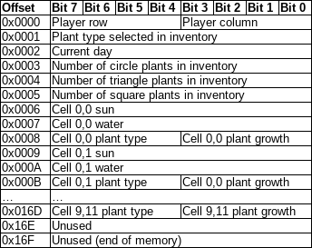

# Devlog

## Project phase F3

### How we satisfied the software requirements

- **F0.a:** Unchanged.
- **F0.b:** Unchanged.
- **F0.c:** Unchanged.
- **F0.d:** Unchanged.
- **F0.e:** Unchanged.
- **F0.f:** Unchanged.
- **F0.g:** Unchanged.
- **F1.a:** Unchanged.
- **F1.b:** Unchanged.
- **F1.c:** Unchanged.
- **F1.d:** Unchanged.
- **F2.a:** Unchanged.
- **F2.b:** Unchanged.
- **F2.c:** The manner in which the code was organized and categorized was lost
  in the transition to JavaScript. That organizational system has since been
  reintroduced.
- **F3.a:** Localizations are implemented as objects whose keys correspond to
  individual situations where a message or label would be displayed, and whose
  mapped values correspond to details on how, specifically, to display the
  message or label. A mapped value may be either a string, a function, or an
  object. The function `translate` then accepts a string that should be a key
  common to all locale objects, accepts aribtrary additional arguments, and
  consults the current locale object. If the key is mapped to a string, that
  string is used unchanged. If the key is mapped to a function, that function is
  called on the additional arguments, and the result is used. If the key is
  mapped to an object, the additional arguments are treated as a sequential key
  path, and the result of resolving it is returned. All places where English
  text was used directly were then changed to instead call `translate`.
- **F3.b:** The game supports English, badly translated traditional Chinese, and
  badly translated Arabic. The translations were obtained using Google
  Translate. The user can select a language from the collapsible options menu.
- **F3.c:** The game was made installable on Android by following the tutorial
  for PWA development linked in the assignment requirements (
  https://developer.mozilla.org/en-US/docs/Web/Progressive_web_apps/Tutorials/js13kGames/Installable_PWAs
  ). This process included writing a manifest file, linking it into the HTML,
  and creating an icon.
- **F3.d:** The game was made playable offline by following the tutorial for PWA
  development linked in the assignment requirements. Specifically, it involved
  adding a service worker to explicitly cache the game's files.

I won't be able to complete the video portion of this assignment, so in lieu of
demonstrating by video that the app can be installed on Android (and probably on
iOS, I don't know, I didn't have the resources to test that) I instead task you
with installing it yourself, disconnecting from the internet, and observing that
it still works. As required for PWA installation to be allowed, I am serving the
app over HTTPS on my VPN:

https://gridfarmer.blujai831.dev

I have personally confirmed it is possible to install the PWA from that page.

### Reflection

No major changes were required to implement F3 that have not already been
discussed above.

## Project phase F2

### How we satisfied the software requirements

- **F2.a:** The weather scenario was implemented by introducing a dynamic
  weather system that changes randomly at the start of each new day. This system
  supports three weather conditions: Sunny, Rainy, and Normal. Each condition
  influences the plants' growth by adjusting sunlight or water resources
  accordingly. A weather-specific emoji and descriptive text are displayed to
  notify the player of the current weather, ensuring an engaging and clear user
  experience. The victory condition was satisfied by requiring the player to
  collect 100 crops in their inventory. This condition is checked at the end of
  each game state update, and when achieved, a win message is displayed to the
  player, signifying successful completion of the game. This clear goal provides
  players with a sense of progression and accomplishment.
- **F2.b:** To satisfy the requirement of implementing a domain-specific
  language (DSL) for defining plant types and their unique growth rules within
  the primary programming language used for the game, I introduced a structured
  and extensible system using TypeScript. The core of this implementation is the
  PlantType enum and associated data structures like PlantGrowthResources and
  the plantGridOffsetsThatMustBeFree dictionary. The PlantType enum acts as the
  DSL's foundation, categorizing plants into Circle, Triangle, and Square, each
  with specific growth rules. These rules are encoded as predicates within
  plantGridOffsetsThatMustBeFree, ensuring flexibility and clarity. This DSL
  defines how plants interact with their environment, such as requiring free
  diagonal neighbors for Circle plants, adjacent neighbors for Triangle plants,
  and all surrounding neighbors for Square plants. By leveraging TypeScript's
  strong typing and modularity, this DSL integrates seamlessly into the game's
  logic, ensuring each plant's growth rules are dynamically and consistently
  applied.
- **F2.c:**We managed to transition the project from TypeScript to JavaScript,
  ensuring compatibility with the Deno runtime and Vite development server. The
  application consists of a dynamic grid rendered on an HTML canvas, interactive
  UI elements for managing plants, and game logic to handle actions like sowing,
  reaping, and advancing days. I configured the development environment using
  deno.json to define tasks such as dev for development and build for
  production. The HTML structure links to the updated main.js, and the game's
  features are designed to reflect real-time changes based on player actions,
  weather effects, and resource management.

### Reflection

Here is how our thinking changed over time:

- I, Anthony, was tasked with handling F2, and I believe I successfully
  implemented all the required elements to satisfy this feature. For F2, we
  already had a victory condition where collecting 100 crops would result in
  winning the game. I decided to enhance the gameplay experience by adding a
  random weather system. This system increases water or sunlight for the plants,
  thereby speeding up the gameplay.
- For F2.b, the condition was already satisfied with the help of my partner, who
  implemented special rules for each type of plant. For example, the circle
  plant cannot grow if there are other plants diagonally adjacent to it.
- For F2.c, I believe this was the most tedious task of all. Initially, I was
  unsure where to start and even considered redoing everything from scratch. I
  honestly doubted whether I would be able to complete this part until I
  realized that TypeScript is quite similar to JavaScript. From there, I found a
  terminal command to convert my main.ts file into main.js. Afterward, I made
  some minor tweaks to the index.html file and the deno.json configuration. In
  the end, I managed to complete this task and feel very proud of myself for not
  wasting too much time on it.

### F2 Video link  
- [F2 Video] https://drive.google.com/drive/folders/1oJ94mi7GdJf0BJKiXDlxUmC-dlQ6zhnt?usp=sharing

## Project phase F1

### How we satisfied the software requirements

- **F0.a:** Same as last week.
- **F0.b:** Same as last week.
- **F0.c:** Same as last week.
- **F0.d:** Same as last week.
- **F0.e:** Same as last week.
- **F0.f:** Same as last week.
- **F0.g:** Same as last week.
- **F1.a:** Data format is array of structures. Great care was taken to ensure
  the data representation is contiguous in memory, per requirements: we use a
  Uint8Array, and getters and setters that work with offsets and bitmasks.
  
- **F1.b:** Manual save/load functionality was added, provided via a slot
  selector input and save/load/erase buttons in a collapsible marked "Save
  management."
- **F1.c:** The game autosaves to and autoloads from slot -1, which is not
  manually accessible, but can effectively be erased with a provided "new game"
  button.
- **F1.d:** An undo and redo system was added, implemented by switching from
  directly storing the memory hex string in localStorage to storing undo and
  redo stacks there. The undo and redo stacks are then arrays of memory hex
  strings. To undo is to move the top of the undo stack to the top of the redo
  stack, and to redo is to move the top of the redo stack to the top of the undo
  stack. The top of the undo stack is at all times regarded as the current game
  state, and successfully moving, reaping, sowing, or advancing time creates a
  new undo step.

### Reflection

Changes of plans:

- Data representation changed from direct JS objects to proxy objects for an
  underlying byte array. This was a fairly high-effort change, but was
  encapsulated with getters and setters so that mostly only a self-contained
  portion of the code needed to change.
- Data representation then changed from byte array to array of byte arrays. This
  was a medium-high-effort change.
- For the majority of the assignment, we did _not_ "think about giving the
  player more feedback," because the requirements page _for the project_ did not
  tell us to do that. I would have appreciated if the project requirements were
  on the project requirements page and not on the devlog requirements page. When
  I go to the devlog requirements page, I expect the fact that I've fulfilled
  all requirements listed on the project requirements page means I'm done
  working on this portion of the project and am now ready to work on the devlog.
  I don't want to do a mental context switch into writing the devlog and then
  have to switch back because the _devlog_ requirements include extra _project_
  requirements. Anyway: Low-effort changes were made last-minute to give the
  player more feedback. I could have done more to this end, but I did not,
  because I felt what I did do was adequate for game legibility purposes despite
  not requiring much effort. The changes ensure that if you can read, then you
  can play the game.

  ### F1 Video link  
- [F1 Video] https://drive.google.com/drive/folders/1oJ94mi7GdJf0BJKiXDlxUmC-dlQ6zhnt?usp=sharing

## Project phase F0

### How we satisfied the software requirements

- **F0.a:** The grid is stored as a two-dimensional array of grid cell records,
  and the player marker as a two-dimensional index into that array. The grid is
  drawn on a canvas using arithmetic. To allow the player marker to move within
  the grid, key and mouse events are read. The player marker can be controlled
  with the arrowkeys or by clicking on grid cells adjacent to the player marker.
- **F0.b:** We store the current day as a counter and display a button whose
  click handler updates that counter and performs between-day logic. Between-day
  logic includes growing plants that can grow, distributing natural resources
  (water and sunlight) over the grid, and updating the display, in that order.
- **F0.c:** The player can reap and sow plants only on the grid cell currently
  occupied by the player marker. If a grid cell is unoccupied and the player has
  at least one seed of the selected type in their inventory, sowing a seed
  transfers it from their inventory to the grid cell as a stage-1 plant. If a
  grid cell is occupied, reaping the plant transfers it from the grid cell to
  the player's inventory as a number of seeds equal to the plant's growth level.
- **F0.d:** A grid cell may have at most 100 water and 100 sun. Every day, each
  cell has a random amount of water added to it, and its amount of sun is set
  randomly. Plant growth consumes water, and requires sun, but does not consume
  sun, since it will be overwritten anyway (since sun amount is set, not
  increased, with each day). For now, we are using builtin JS RNG.
- **F0.e:** There are circle, triangle, and square plants. Each can have growth
  level 1, 2, or 3.
- **F0.f:** Circle plants can only grow if there are no diagonally adjacent
  plants. Triangle plants can only grow if there are no cardinally adjacent
  plants. Square plants can only grow if there are neither diagonally nor
  cardinally adjacent plants. Plants at growth level 1 require 50 water and 50
  sun to grow. Plants at growth level 2 require 75 water and 75 sun to grow.
  Plants at growth level 3 do not grow further.
- **F0.g:** The game is won when the total seeds in the player's inventory meet
  or exceed 100 in number.

### Reflection

Here is how our thinking changed over time:

- I, Jaime, was supposed to be the tool lead, and Quinlan was supposed to be the
  engine lead. I grew concerned that we were far behind, and started us off. In
  the process, by necessity, I took over some of the engine work.
- My engine implementation was really overcomplicated and highly general. For
  reference, it involved expressions like
  `await new Promise(requestAnimationFrame)` and
  `new Promise((resolve) => subscribers.push(resolve))`. It would have been
  appropriate for developing a continuous-motion 2D game with rich animations. I
  think I have a bad habit of overscoping when I'm panicking. You'd think it
  would be the opposite, but it isn't.
- Mercifully, Quinlan started from scratch and laid the groundwork for a much
  more appropriately-scoped engine. He implemented a great deal of the F0
  requirements, and I picked up where he left off and finished it up. I was able
  to constrain myself to the established implementation and coding style much
  more effectively with some work already in front of me to build on.

### F0 Video link  
- [F0 Video] https://drive.google.com/drive/folders/1oJ94mi7GdJf0BJKiXDlxUmC-dlQ6zhnt?usp=sharing